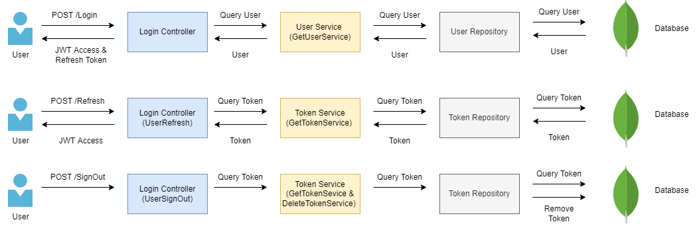
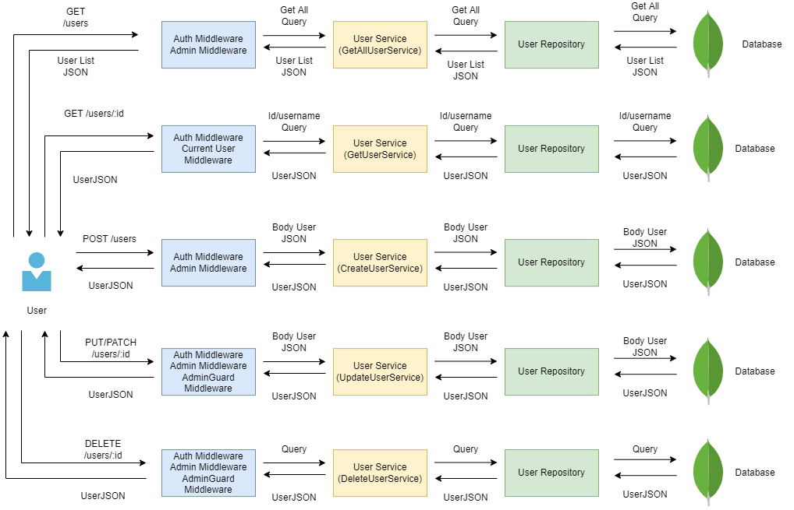
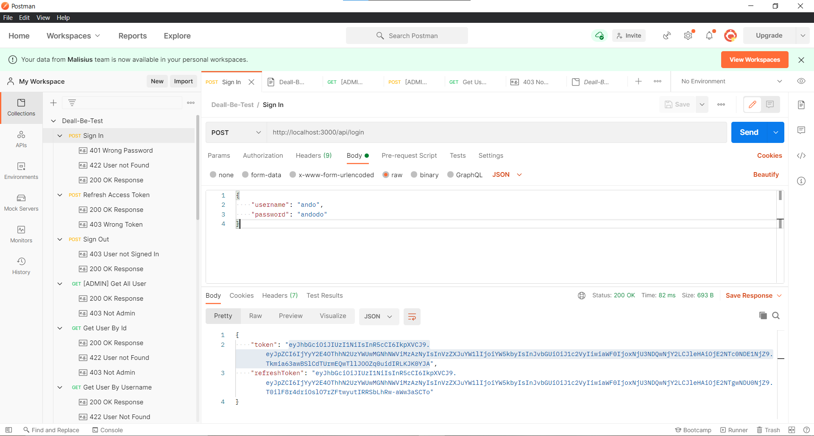
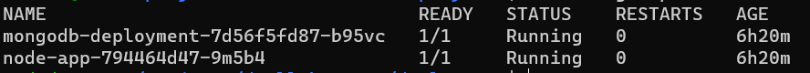
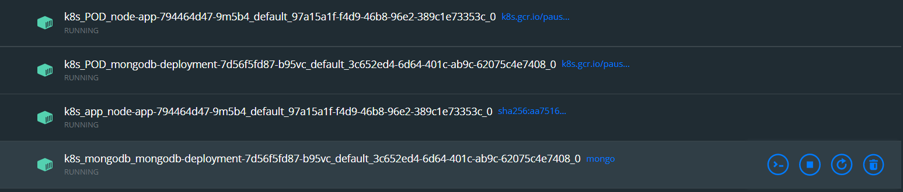

# 🚀 CRUD REST API for Deall Jobs Backend Engineer Test

## 🚀 CRUD REST API for Deall Jobs Backend Engineer test - Julando Omar
\
\
📌 **Feature:**
- CRUD REST API Architecture 🚀
- JWT Token Authentication 🛡
- Refresh Token Authentication 🔃
- Ready to use with K8s 🛠
<!-- end of the list -->
\
📃 **Documentation:**
Documentation can be found on:
[Documentation Link 🔗](https://documenter.getpostman.com/view/14749953/UzJPMvT1)
\
\
📋 **Architecture Diagram Flow:**
- Login Flow 🔐

- CRUD User Flow 👨‍💻👩‍💻

<!-- end of the list-->
\
\
⚙ **Requirement:**
- Docker Installed ✅
- Kubernetes Installed (minikube, kubectl) ✅
<!-- end of the list -->
\
🛠 **How To use:**
- Clone the repo with command
    ```bash
    git clone https://github.com/ando-hunterz/deall-jobs-be-test.git
    ```
    or
    ```bash
    git clone git@github.com:ando-hunterz/deall-jobs-be-test.git
    ```

- Run Deployment Scripts
    ```bash
    ./deployment/deployment.sh
    ```

- Access via localhost at port 3000 / Postman 💎
<!-- end of the list -->
\
📷 **Deployment Screenshots:**

Postman API Check


Kubectl Deployment


Docker Desktop Containers

\
\
🔑 **Admin Credentials:**  
username: admin  
password: admin
